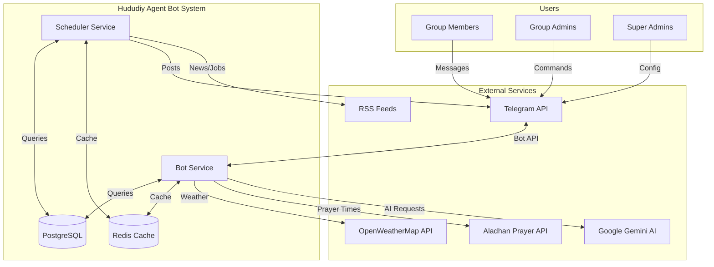
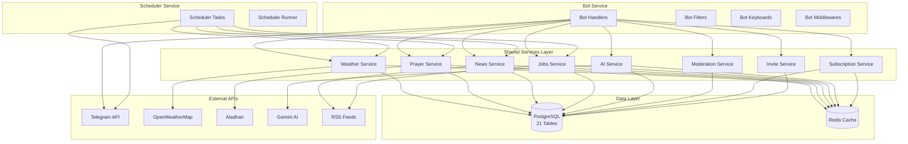
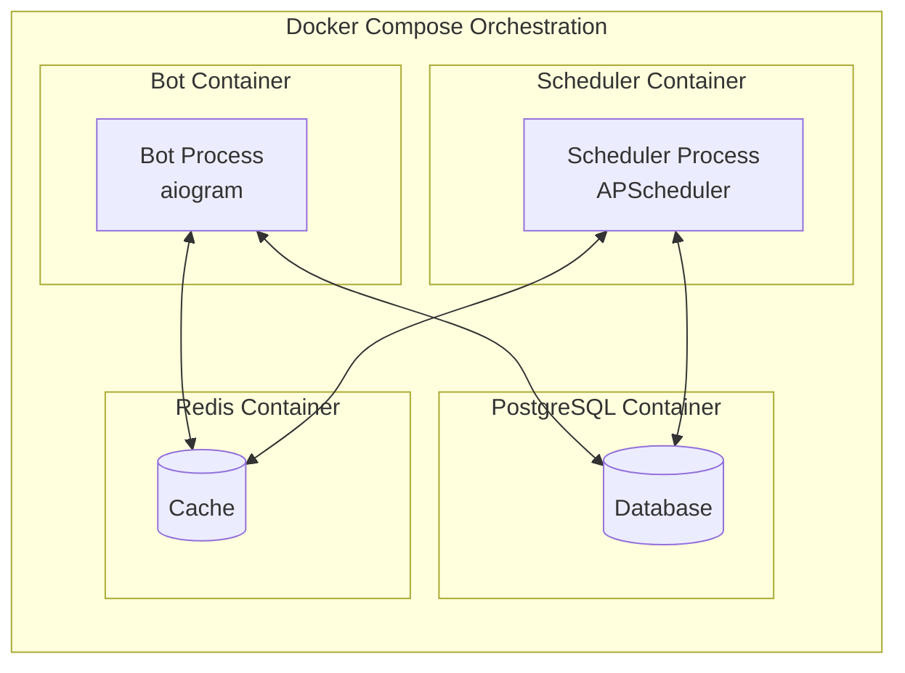
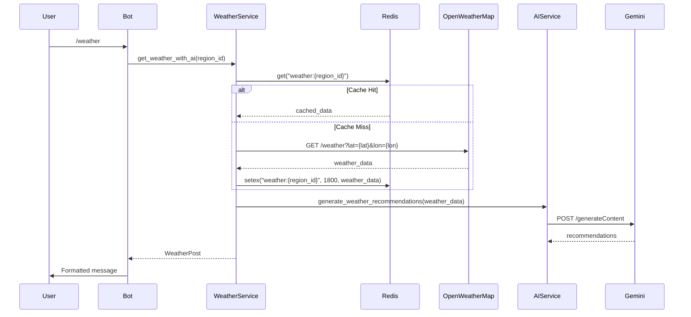
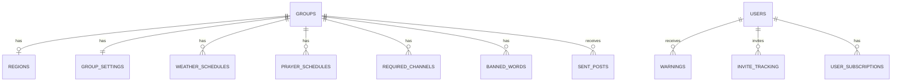
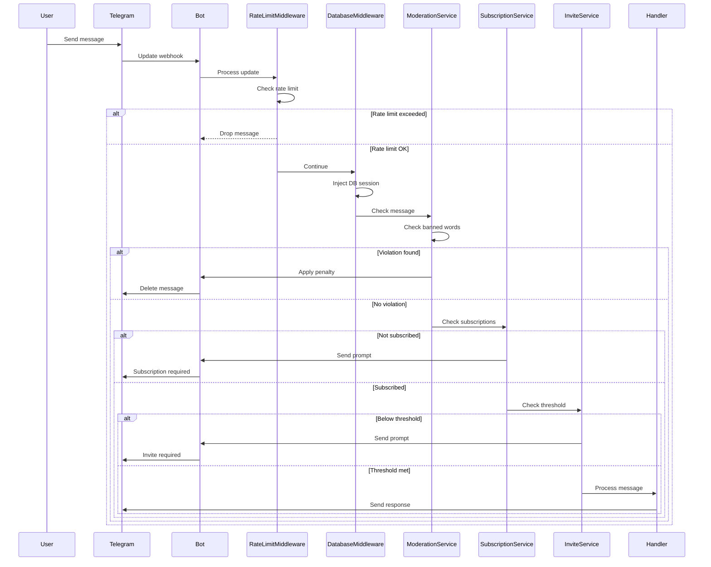
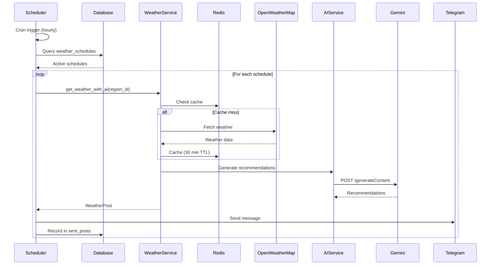
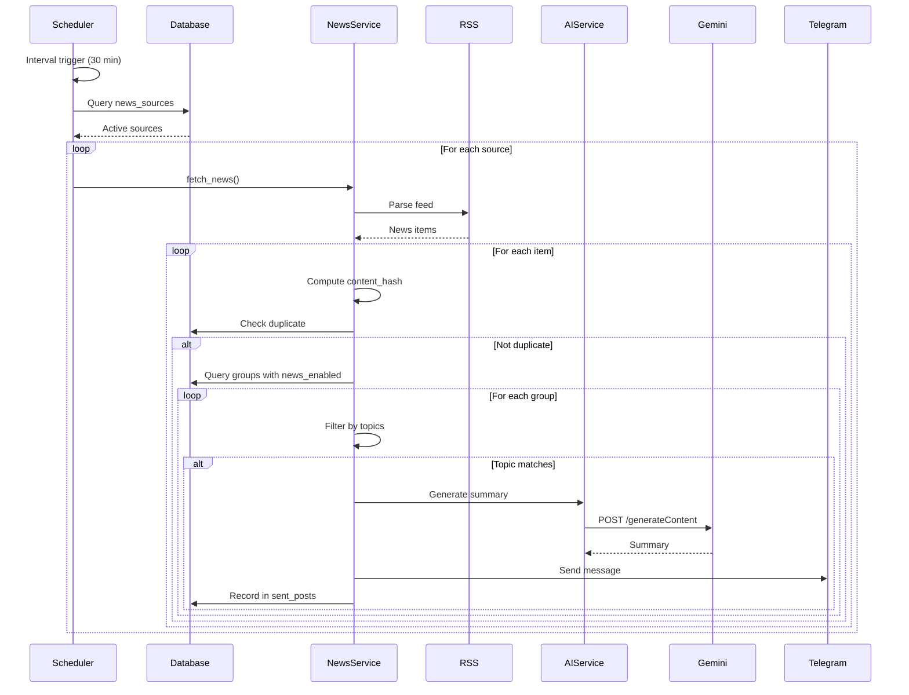

# Technical Design Document

## Overview

### Purpose

This document provides the complete technical design for the Hududiy Agent Bot, a professional Telegram bot system for group and channel automation in Uzbekistan. The bot delivers weather updates, prayer times, news aggregation, job listings, AI assistance, content moderation, subscription enforcement, and invite tracking across multiple Telegram communities.

### Scope

The design covers all 50 functional requirements defined in the requirements document, including:

- **8 Core Modules**: Weather, Prayer Times, News, Jobs, AI Assistant, Moderation, Subscription Enforcement, Invite Tracking
- **Infrastructure**: PostgreSQL database, Redis cache, APScheduler task execution
- **External Integrations**: Telegram Bot API, OpenWeatherMap API, Aladhan API, Google Gemini AI API, RSS feeds
- **Deployment**: Docker containerization with multi-service orchestration
- **Security**: Input validation, permission checks, rate limiting, API key management
- **Performance**: Caching strategies, query optimization, connection pooling
- **Reliability**: Retry logic, graceful degradation, health monitoring

### System Context



### Design Principles

1. **Modularity**: Each feature module (Weather, Prayer, News, Jobs, AI, Moderation, Subscription, Invite) is independently configurable and can be enabled/disabled per group
2. **Scalability**: Separate bot and scheduler processes allow horizontal scaling; Redis caching reduces API load
3. **Reliability**: Retry logic, graceful degradation, and health checks ensure continuous operation
4. **Security**: Input validation, permission checks, and rate limiting protect against abuse
5. **Maintainability**: Clear separation of concerns, structured logging, and database migrations support long-term evolution

---

## Architecture

### High-Level Architecture

The system follows a **microservices-inspired architecture** with two main processes:

1. **Bot Service**: Handles real-time user interactions, commands, and message processing
2. **Scheduler Service**: Executes time-based tasks (weather posts, prayer times, news aggregation, cleanup)

Both services share:
- **PostgreSQL Database**: Persistent storage for all bot data (21 tables)
- **Redis Cache**: Performance optimization for API responses and rate limiting
- **Telegram Bot API**: Communication channel with users and groups

### Component Architecture



### Process Architecture




### Technology Stack

| Layer | Technology | Purpose |
|-------|-----------|---------|
| **Bot Framework** | aiogram 3.x | Telegram Bot API wrapper with async support |
| **Scheduler** | APScheduler 3.x | Cron-like task scheduling |
| **Database** | PostgreSQL 16 | Persistent data storage |
| **Cache** | Redis 7 | Performance optimization, rate limiting |
| **ORM** | SQLAlchemy 2.x | Database abstraction and migrations |
| **Migration Tool** | Alembic | Database schema versioning |
| **Configuration** | Pydantic Settings | Type-safe environment variable management |
| **Logging** | Python logging | Structured application logging |
| **HTTP Client** | aiohttp | Async HTTP requests to external APIs |
| **RSS Parser** | feedparser | RSS/Atom feed parsing |
| **Containerization** | Docker + Docker Compose | Service orchestration |
| **Language** | Python 3.11+ | Application runtime |

---

## Components and Interfaces

### 1. Bot Service

**Responsibility**: Handle real-time user interactions, process commands, enforce moderation and subscription rules.

#### 1.1 Bot Handlers (`app/bot/handlers/`)

**Purpose**: Process incoming Telegram updates (messages, commands, callbacks).

**Modules**:

- **`common.py`**: Start command, help command, error handling
- **`user_commands.py`**: User-facing commands (`/weather`, `/prayer`, `/news`, `/jobs`, `/ai`)
- **`admin.py`**: Admin commands (`/admin`, region config, schedule management, banned words)
- **`group_events.py`**: New member welcome, bot added to group, member left

**Key Interfaces**:

```python
# Handler registration pattern
async def start_command(message: Message, state: FSMContext):
    """Handle /start command."""
    pass

async def weather_command(message: Message, db: AsyncSession, redis: Redis):
    """Handle /weather command - fetch and display current weather."""
    pass

async def admin_panel(callback: CallbackQuery, db: AsyncSession):
    """Handle /admin command - show configuration panel."""
    pass
```


#### 1.2 Bot Filters (`app/bot/filters/`)

**Purpose**: Filter incoming updates based on conditions (admin status, super admin, group type).

**Modules**:

- **`admin_filter.py`**: Check if user is group admin or super admin

**Key Interfaces**:

```python
class IsAdminFilter(Filter):
    """Filter for group administrators."""
    async def __call__(self, message: Message, db: AsyncSession) -> bool:
        # Check if user is admin in the group
        pass

class IsSuperAdminFilter(Filter):
    """Filter for super administrators."""
    async def __call__(self, message: Message) -> bool:
        # Check if user ID is in SUPER_ADMIN_IDS
        pass
```

#### 1.3 Bot Keyboards (`app/bot/keyboards/`)

**Purpose**: Generate inline keyboards for interactive configuration.

**Modules**:

- **`admin_keyboards.py`**: Admin panel keyboards, module toggles, schedule management

**Key Interfaces**:

```python
def get_admin_panel_keyboard() -> InlineKeyboardMarkup:
    """Generate main admin panel keyboard."""
    pass

def get_module_settings_keyboard(module: str, enabled: bool) -> InlineKeyboardMarkup:
    """Generate module-specific settings keyboard."""
    pass

def get_schedule_management_keyboard(schedules: List[Schedule]) -> InlineKeyboardMarkup:
    """Generate schedule management keyboard."""
    pass
```

#### 1.4 Bot Middlewares (`app/bot/middlewares/`)

**Purpose**: Process updates before/after handlers (database injection, rate limiting, caching).

**Modules**:

- **`database.py`**: Inject database session into handlers
- **`redis_middleware.py`**: Inject Redis connection into handlers
- **`rate_limit.py`**: Enforce message rate limits per user

**Key Interfaces**:

```python
class DatabaseMiddleware(BaseMiddleware):
    """Inject database session into handler context."""
    async def __call__(self, handler, event, data):
        async with async_session_maker() as session:
            data["db"] = session
            return await handler(event, data)
```


### 2. Scheduler Service

**Responsibility**: Execute time-based tasks (weather posts, prayer posts, news aggregation, job aggregation, cleanup).

#### 2.1 Scheduler Runner (`app/scheduler/runner.py`)

**Purpose**: Initialize APScheduler and register all scheduled tasks.

**Key Interfaces**:

```python
async def start_scheduler():
    """Initialize and start APScheduler."""
    scheduler = AsyncIOScheduler(timezone="Asia/Tashkent")
    
    # Register tasks
    scheduler.add_job(post_scheduled_weather, "cron", hour="*", minute="0")
    scheduler.add_job(post_scheduled_prayer, "cron", hour="6", minute="0")
    scheduler.add_job(aggregate_news, "interval", minutes=30)
    scheduler.add_job(aggregate_jobs, "interval", hours=1)
    scheduler.add_job(cleanup_old_data, "cron", hour="3", minute="0")
    
    scheduler.start()
```

#### 2.2 Scheduler Tasks (`app/scheduler/tasks.py`)

**Purpose**: Define scheduled task logic.

**Key Functions**:

```python
async def post_scheduled_weather():
    """Post weather updates to groups with active schedules."""
    # Query groups with weather schedules matching current time
    # For each group: fetch weather, generate AI recommendations, post to group
    pass

async def post_scheduled_prayer():
    """Post prayer times to groups with active schedules."""
    # Query groups with prayer schedules matching current time
    # For each group: fetch prayer times, post to group
    pass

async def aggregate_news():
    """Fetch and post news from RSS feeds."""
    # Fetch all active news sources
    # Parse RSS feeds, filter by topic, check for duplicates
    # Generate AI summaries, post to groups with news enabled
    pass

async def aggregate_jobs():
    """Fetch and post job listings from sources."""
    # Fetch all active job sources
    # Parse job listings, filter by region, check for duplicates
    # Post to groups with jobs enabled
    pass

async def cleanup_old_data():
    """Delete old records from database."""
    # Delete sent_posts older than 30 days
    # Delete ai_logs older than 90 days
    # Delete admin_logs older than 180 days
    # Delete user_subscriptions older than 7 days
    pass
```


### 3. Service Layer

**Responsibility**: Implement business logic for each feature module.

#### 3.1 Weather Service (`app/services/weather_service.py`)

**Purpose**: Fetch weather data from OpenWeatherMap API, cache results, generate AI recommendations.

**Key Interfaces**:

```python
class WeatherService:
    def __init__(self, db: AsyncSession, redis: Redis, api_key: str):
        self.db = db
        self.redis = redis
        self.api_key = api_key
    
    async def get_weather(self, region_id: int) -> WeatherData:
        """Fetch weather for region (cached for 30 minutes)."""
        # Check cache first
        # If cache miss, call OpenWeatherMap API
        # Cache result with 30-minute TTL
        # Return weather data
        pass
    
    async def get_weather_with_ai(self, region_id: int) -> WeatherPost:
        """Fetch weather and generate AI recommendations."""
        weather = await self.get_weather(region_id)
        recommendations = await self.ai_service.generate_weather_recommendations(weather)
        return WeatherPost(weather=weather, recommendations=recommendations)
    
    async def format_weather_message(self, weather_post: WeatherPost) -> str:
        """Format weather data and AI recommendations as Telegram message."""
        pass
```

**Data Flow**:




#### 3.2 Prayer Service (`app/services/prayer_service.py`)

**Purpose**: Fetch prayer times from Aladhan API, cache results.

**Key Interfaces**:

```python
class PrayerService:
    def __init__(self, db: AsyncSession, redis: Redis):
        self.db = db
        self.redis = redis
    
    async def get_prayer_times(self, region_id: int, date: str) -> PrayerTimes:
        """Fetch prayer times for region and date (cached for 24 hours)."""
        # Check cache first
        # If cache miss, call Aladhan API
        # Cache result with 24-hour TTL
        # Return prayer times (Fajr, Dhuhr, Asr, Maghrib, Isha)
        pass
    
    async def format_prayer_message(self, prayer_times: PrayerTimes) -> str:
        """Format prayer times as Telegram message."""
        pass
```

#### 3.3 News Service (`app/services/news_service.py`)

**Purpose**: Aggregate news from RSS feeds, filter by topic, check for duplicates, generate AI summaries.

**Key Interfaces**:

```python
class NewsService:
    def __init__(self, db: AsyncSession, redis: Redis):
        self.db = db
        self.redis = redis
    
    async def fetch_news(self, topics: List[str] = None) -> List[NewsItem]:
        """Fetch news from all active RSS sources."""
        # Query active news sources from database
        # Parse each RSS feed
        # Filter by topics if provided
        # Compute content hash for each item
        # Return list of news items
        pass
    
    async def is_duplicate(self, group_id: int, content_hash: str) -> bool:
        """Check if news item was already posted to group."""
        # Query sent_posts table
        pass
    
    async def post_news_to_group(self, group_id: int, news_item: NewsItem):
        """Post news item to group with AI summary."""
        # Generate AI summary
        # Format message
        # Send to Telegram
        # Record in sent_posts
        pass
```


#### 3.4 Jobs Service (`app/services/jobs_service.py`)

**Purpose**: Aggregate job listings from multiple sources, filter by region, check for duplicates.

**Key Interfaces**:

```python
class JobsService:
    def __init__(self, db: AsyncSession, redis: Redis):
        self.db = db
        self.redis = redis
    
    async def fetch_jobs(self, region_id: int = None) -> List[JobListing]:
        """Fetch job listings from all active sources."""
        # Query active job sources (OLX, hh.uz, ishbor.uz)
        # Parse each source
        # Filter by region if provided
        # Compute content hash for each listing
        # Return list of job listings
        pass
    
    async def is_duplicate(self, group_id: int, content_hash: str) -> bool:
        """Check if job listing was already posted to group."""
        pass
    
    async def post_job_to_group(self, group_id: int, job: JobListing):
        """Post job listing to group."""
        # Format message
        # Send to Telegram
        # Record in sent_posts
        pass
```

#### 3.5 AI Service (`app/services/gemini_service.py`)

**Purpose**: Interface with Google Gemini AI API for weather recommendations, news summaries, and user questions.

**Key Interfaces**:

```python
class GeminiService:
    def __init__(self, db: AsyncSession, redis: Redis, api_key: str):
        self.db = db
        self.redis = redis
        self.api_key = api_key
    
    async def generate_weather_recommendations(self, weather_data: WeatherData) -> str:
        """Generate activity recommendations based on weather."""
        prompt = f"Weather: {weather_data.temp}°C, {weather_data.conditions}. Suggest activities."
        return await self._call_gemini(prompt)
    
    async def generate_news_summary(self, news_item: NewsItem) -> str:
        """Generate concise summary of news article."""
        prompt = f"Summarize: {news_item.title}. {news_item.description}"
        return await self._call_gemini(prompt)
    
    async def answer_question(self, user_id: int, group_id: int, question: str) -> str:
        """Answer user question with rate limiting."""
        # Check rate limit (10 requests per hour per user)
        # Call Gemini API
        # Log request and response
        return await self._call_gemini(question)
    
    async def _call_gemini(self, prompt: str) -> str:
        """Internal method to call Gemini API with retry logic."""
        pass
```


#### 3.6 Moderation Service (`app/services/moderation_service.py`)

**Purpose**: Filter banned words, apply penalties, track warnings.

**Key Interfaces**:

```python
class ModerationService:
    def __init__(self, db: AsyncSession, bot: Bot):
        self.db = db
        self.bot = bot
    
    async def check_message(self, message: Message, group_id: int) -> ModerationResult:
        """Check message for banned words."""
        # Query banned words for group
        # Perform case-insensitive matching
        # Return result with matched words
        pass
    
    async def apply_penalty(self, user_id: int, group_id: int, penalty_type: str):
        """Apply configured penalty."""
        if penalty_type == "delete":
            await self.bot.delete_message(group_id, message_id)
        elif penalty_type == "warn":
            await self._add_warning(user_id, group_id)
            await self.bot.delete_message(group_id, message_id)
        elif penalty_type == "mute":
            await self.bot.restrict_chat_member(group_id, user_id, until_date=...)
            await self.bot.delete_message(group_id, message_id)
        elif penalty_type == "ban":
            await self.bot.ban_chat_member(group_id, user_id)
            await self.bot.delete_message(group_id, message_id)
    
    async def _add_warning(self, user_id: int, group_id: int):
        """Add warning and check for auto-mute threshold."""
        # Insert warning record
        # Count total warnings
        # If count >= 3, auto-mute for 24 hours
        pass
```

#### 3.7 Subscription Service (`app/services/subscription_service.py`)

**Purpose**: Enforce mandatory channel subscriptions before allowing posts.

**Key Interfaces**:

```python
class SubscriptionService:
    def __init__(self, db: AsyncSession, redis: Redis, bot: Bot):
        self.db = db
        self.redis = redis
        self.bot = bot
    
    async def check_subscriptions(self, user_id: int, group_id: int) -> SubscriptionStatus:
        """Check if user is subscribed to all required channels."""
        # Check cache first (5-minute TTL)
        # Query required channels (global + group-specific)
        # For each channel, check subscription via Telegram API
        # Cache result
        # Return status with missing channels
        pass
    
    async def get_subscription_prompt(self, missing_channels: List[Channel]) -> str:
        """Generate subscription prompt message with channel links."""
        pass
```


#### 3.8 Invite Service (`app/services/invite_service.py`)

**Purpose**: Track user invites, validate invites, enforce posting thresholds.

**Key Interfaces**:

```python
class InviteService:
    def __init__(self, db: AsyncSession):
        self.db = db
    
    async def track_invite(self, inviter_id: int, invited_id: int, group_id: int):
        """Record invite and validate."""
        # Check if invited user is a bot
        # Check if invite is duplicate (same inviter, invited, group)
        # Insert record with is_valid flag
        pass
    
    async def get_valid_invite_count(self, user_id: int, group_id: int) -> int:
        """Count valid invites for user in group."""
        # Query invite_tracking where inviter_id = user_id, group_id = group_id, is_valid = true
        pass
    
    async def check_threshold(self, user_id: int, group_id: int) -> bool:
        """Check if user meets invite threshold."""
        # Get group's invite_threshold from settings
        # Get user's valid invite count
        # Return count >= threshold
        pass
```

### 4. Data Layer

#### 4.1 Database Models (`app/database/models.py`)

**Purpose**: Define SQLAlchemy ORM models for all 21 tables.

**Tables**:

1. **regions**: Geographic regions (viloyat, tuman, coordinates)
2. **users**: Telegram users (telegram_id, username, full_name)
3. **groups**: Telegram groups/channels (telegram_id, title, region_id)
4. **group_settings**: Per-group configuration (module toggles, penalties, thresholds)
5. **weather_schedules**: Weather posting schedules
6. **prayer_schedules**: Prayer posting schedules
7. **news_sources**: RSS feed sources for news
8. **job_sources**: Job listing sources
9. **sent_posts**: Duplicate detection (group_id, content_hash, post_type)
10. **required_channels**: Mandatory subscription channels (global + group-specific)
11. **user_subscriptions**: Cached subscription status
12. **invite_tracking**: Invite records (inviter_id, invited_id, is_valid)
13. **banned_words**: Per-group banned words
14. **warnings**: User warnings (user_id, group_id, reason)
15. **ai_logs**: AI request/response logs
16. **admin_logs**: Admin action audit logs
17. **global_settings**: Global configuration (API keys)
18. **scheduled_posts**: Scheduled advertisement posts


**Key Relationships**:



#### 4.2 Database Session Management (`app/database/session.py`)

**Purpose**: Manage database connections and sessions.

**Key Interfaces**:

```python
from sqlalchemy.ext.asyncio import create_async_engine, AsyncSession, async_sessionmaker

engine = create_async_engine(
    settings.database_url_async,
    echo=False,
    pool_size=10,
    max_overflow=20,
    pool_pre_ping=True,  # Verify connections before use
    pool_recycle=3600,   # Recycle connections after 1 hour
)

async_session_maker = async_sessionmaker(
    engine,
    class_=AsyncSession,
    expire_on_commit=False,
)

async def get_db() -> AsyncSession:
    """Dependency for database session."""
    async with async_session_maker() as session:
        yield session
```

#### 4.3 Redis Cache Management

**Purpose**: Manage Redis connections and caching operations.

**Key Interfaces**:

```python
import redis.asyncio as redis

redis_client = redis.from_url(
    settings.REDIS_URL,
    encoding="utf-8",
    decode_responses=True,
)

async def get_redis() -> redis.Redis:
    """Dependency for Redis connection."""
    return redis_client

# Cache key patterns
CACHE_KEYS = {
    "weather": "weather:{region_id}",
    "prayer": "prayer:{region_id}:{date}",
    "subscription": "subscription:{user_id}:{group_id}",
    "rate_limit_ai": "rate_limit:ai:{user_id}",
    "rate_limit_msg": "rate_limit:msg:{user_id}",
}
```


### 5. Configuration and Utilities

#### 5.1 Configuration Management (`app/utils/config.py`)

**Purpose**: Load and validate environment variables using Pydantic.

**Key Configuration**:

```python
class Settings(BaseSettings):
    # Required
    BOT_TOKEN: str
    SUPER_ADMIN_IDS: str  # Comma-separated list
    DATABASE_URL: str
    REDIS_URL: str
    
    # Optional with defaults
    GEMINI_API_KEY: str = ""
    WEATHER_API_KEY: str = ""
    TIMEZONE: str = "Asia/Tashkent"
    LOG_LEVEL: str = "INFO"
    SERVICE_TYPE: str = "bot"  # "bot" or "scheduler"
    
    @property
    def super_admin_ids_list(self) -> List[int]:
        return [int(id.strip()) for id in self.SUPER_ADMIN_IDS.split(",")]
```

#### 5.2 Logging (`app/utils/logger.py`)

**Purpose**: Configure structured logging.

**Configuration**:

```python
import logging
from logging.handlers import RotatingFileHandler

def setup_logger(name: str, level: str = "INFO") -> logging.Logger:
    logger = logging.getLogger(name)
    logger.setLevel(level)
    
    # Console handler
    console_handler = logging.StreamHandler()
    console_handler.setFormatter(logging.Formatter(
        "%(asctime)s - %(name)s - %(levelname)s - %(message)s"
    ))
    logger.addHandler(console_handler)
    
    # File handler with rotation
    file_handler = RotatingFileHandler(
        f"logs/{name}.log",
        maxBytes=10*1024*1024,  # 10MB
        backupCount=5
    )
    file_handler.setFormatter(logging.Formatter(
        "%(asctime)s - %(name)s - %(levelname)s - %(funcName)s:%(lineno)d - %(message)s"
    ))
    logger.addHandler(file_handler)
    
    return logger
```

#### 5.3 Input Validation (`app/utils/validators.py`)

**Purpose**: Validate user inputs to prevent injection and malformed data.

**Key Functions**:

```python
def validate_url(url: str) -> bool:
    """Validate URL is well-formed and uses HTTPS."""
    pass

def validate_time_format(time_str: str) -> bool:
    """Validate time string is in HH:MM format."""
    pass

def validate_threshold(value: int, min_val: int = 1, max_val: int = 100) -> bool:
    """Validate numeric threshold is within bounds."""
    pass

def sanitize_text(text: str) -> str:
    """Sanitize text input to prevent SQL injection."""
    pass
```


---

## Data Models

### Core Data Structures

#### WeatherData

```python
@dataclass
class WeatherData:
    temperature: float
    feels_like: float
    conditions: str
    humidity: int
    wind_speed: float
    pressure: int
    visibility: int
    timestamp: datetime
```

#### PrayerTimes

```python
@dataclass
class PrayerTimes:
    fajr: str
    dhuhr: str
    asr: str
    maghrib: str
    isha: str
    date: str
    hijri_date: str
```

#### NewsItem

```python
@dataclass
class NewsItem:
    title: str
    description: str
    link: str
    published_date: datetime
    source: str
    topic: str
    content_hash: str
    ai_summary: Optional[str] = None
```

#### JobListing

```python
@dataclass
class JobListing:
    title: str
    company: str
    location: str
    salary: Optional[str]
    link: str
    published_date: datetime
    source: str
    content_hash: str
```

#### ModerationResult

```python
@dataclass
class ModerationResult:
    has_violation: bool
    matched_words: List[str]
    penalty_type: str
```

#### SubscriptionStatus

```python
@dataclass
class SubscriptionStatus:
    is_subscribed: bool
    missing_channels: List[Channel]
```


---

## API Integrations

### 1. Telegram Bot API

**Purpose**: Send/receive messages, manage groups, check subscriptions.

**Base URL**: `https://api.telegram.org/bot{token}/`

**Key Endpoints**:

| Method | Endpoint | Purpose |
|--------|----------|---------|
| POST | `/sendMessage` | Send text message to chat |
| POST | `/deleteMessage` | Delete message from chat |
| POST | `/restrictChatMember` | Mute user in group |
| POST | `/banChatMember` | Ban user from group |
| GET | `/getChatMember` | Check user's membership status |
| POST | `/sendPhoto` | Send photo with caption |

**Authentication**: Bearer token in URL path.

**Rate Limits**: 30 messages per second per bot, 20 messages per minute per chat.

**Error Handling**:
- Retry on network errors (3 attempts with exponential backoff)
- Log and skip on 403 Forbidden (bot blocked)
- Log and skip on 400 Bad Request (invalid chat_id)

### 2. OpenWeatherMap API

**Purpose**: Fetch current weather data and forecasts.

**Base URL**: `https://api.openweathermap.org/data/2.5/`

**Key Endpoints**:

| Method | Endpoint | Purpose |
|--------|----------|---------|
| GET | `/weather` | Current weather by coordinates |
| GET | `/forecast` | 5-day forecast by coordinates |

**Request Example**:

```http
GET /weather?lat=41.2995&lon=69.2401&appid={api_key}&units=metric&lang=uz
```

**Response Example**:

```json
{
  "main": {
    "temp": 25.3,
    "feels_like": 24.8,
    "humidity": 45,
    "pressure": 1013
  },
  "weather": [{"main": "Clear", "description": "clear sky"}],
  "wind": {"speed": 3.5},
  "visibility": 10000
}
```

**Caching Strategy**: Cache for 30 minutes per region.

**Error Handling**:
- Retry on 5xx errors (3 attempts)
- Log and skip on 401 Unauthorized (invalid API key)
- Fallback to cached data if available


### 3. Aladhan Prayer Times API

**Purpose**: Fetch Islamic prayer times by coordinates.

**Base URL**: `https://api.aladhan.com/v1/`

**Key Endpoints**:

| Method | Endpoint | Purpose |
|--------|----------|---------|
| GET | `/timings/{date}` | Prayer times for specific date |
| GET | `/calendar/{year}/{month}` | Monthly prayer times |

**Request Example**:

```http
GET /timings/01-01-2024?latitude=41.2995&longitude=69.2401&method=2
```

**Response Example**:

```json
{
  "data": {
    "timings": {
      "Fajr": "05:45",
      "Dhuhr": "12:30",
      "Asr": "15:45",
      "Maghrib": "18:15",
      "Isha": "19:45"
    },
    "date": {
      "hijri": "15 Jumada Al-Akhirah 1445"
    }
  }
}
```

**Caching Strategy**: Cache for 24 hours per region per date.

**Error Handling**:
- Retry on network errors (3 attempts)
- Log and skip on API errors
- Fallback to cached data if available

### 4. Google Gemini AI API

**Purpose**: Generate weather recommendations, news summaries, answer user questions.

**Base URL**: `https://generativelanguage.googleapis.com/v1beta/`

**Key Endpoints**:

| Method | Endpoint | Purpose |
|--------|----------|---------|
| POST | `/models/gemini-pro:generateContent` | Generate text completion |

**Request Example**:

```json
{
  "contents": [{
    "parts": [{
      "text": "Weather is 25°C and sunny. Suggest outdoor activities."
    }]
  }],
  "generationConfig": {
    "temperature": 0.7,
    "maxOutputTokens": 200
  }
}
```

**Response Example**:

```json
{
  "candidates": [{
    "content": {
      "parts": [{
        "text": "Perfect weather for outdoor activities! Consider..."
      }]
    }
  }]
}
```

**Rate Limiting**: 10 requests per hour per user for `/ai` command.

**Error Handling**:
- Retry on 5xx errors (3 attempts)
- Log and skip on 429 Too Many Requests
- Graceful degradation: post content without AI enhancement


### 5. RSS Feeds (News and Jobs)

**Purpose**: Aggregate news and job listings from multiple sources.

**Supported Sources**:

**News Sources**:
- kun.uz RSS feed
- daryo.uz RSS feed
- gazeta.uz RSS feed

**Job Sources**:
- OLX.uz jobs RSS
- hh.uz RSS feed
- ishbor.uz RSS feed

**Parsing Strategy**:

```python
import feedparser

async def parse_rss_feed(url: str) -> List[Dict]:
    """Parse RSS feed and extract items."""
    feed = feedparser.parse(url)
    items = []
    for entry in feed.entries:
        items.append({
            "title": entry.title,
            "description": entry.get("description", ""),
            "link": entry.link,
            "published": entry.get("published_parsed", None),
        })
    return items
```

**Error Handling**:
- Retry on network errors (3 attempts)
- Log and skip on parse errors
- Continue with remaining feeds if one fails

---

## Data Flow

### User Message Processing Flow




### Scheduled Weather Post Flow



### News Aggregation Flow



